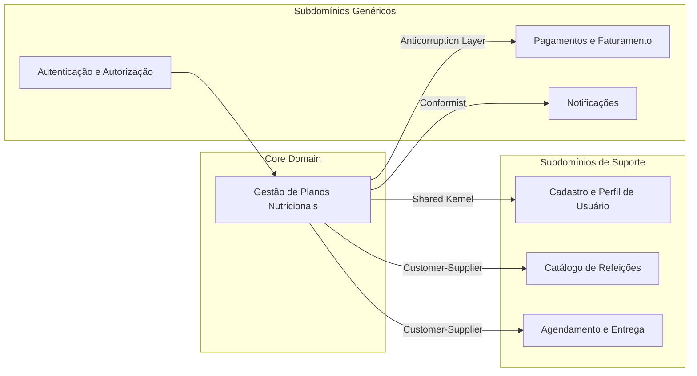
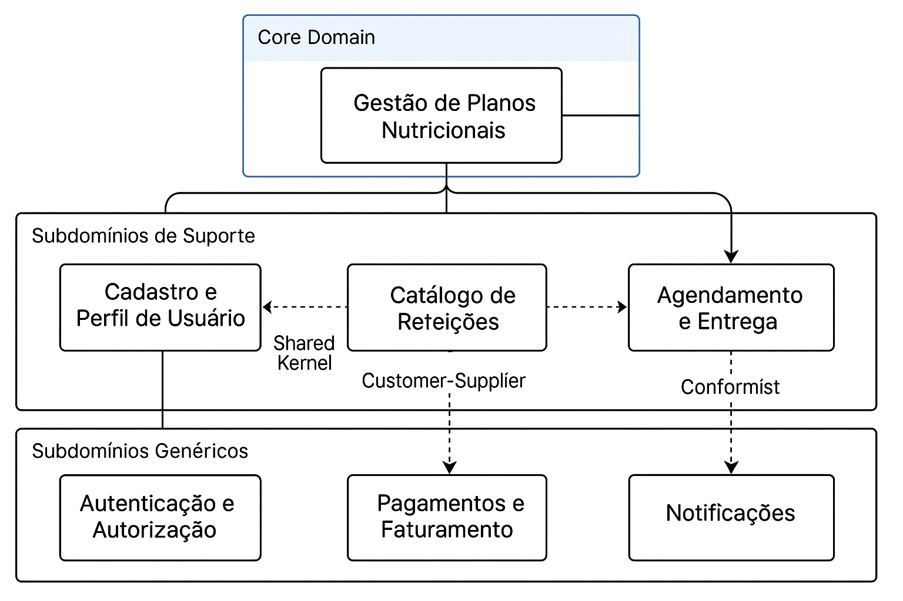

📚 Domain Driven Design - Design Estratégico do Projeto
---

# 👥 1. Equipe
| **RM**   | **Nome**                  |
|----------|---------------------------|
| RM362208 | Adriano Rabello           |
| RM365052 | Francielli manchini tateo |
| RM364993 | Fábio Ivo Silva           |
| RM365124 | Renato Magri Trevine      |

---

## 🎯 Objetivo
Identificar os **subdomínios** do projeto, classificá-los como **Core, Supporting ou Generic**, e desenhar os **Bounded Contexts** que delimitam responsabilidades e interações.  
Este exercício tem como meta construir uma **visão estratégica e de alto nível** do domínio, preparando o terreno para o **Design Tático**.

## 🏷️ 1. Nome do Projeto
**Magraz — Plataforma Inteligente de Gestão e Personalização de Dietas Saudáveis**

---

## 💡 2. Objetivo Principal do Projeto

Desenvolver uma **plataforma digital integrada** que conecte **nutricionistas**, **fornecedores de refeições saudáveis** e **clientes finais**, permitindo a criação de **planos nutricionais personalizados** e o acompanhamento contínuo do progresso.  
O sistema busca **promover hábitos alimentares saudáveis**, **reduzir o tempo de planejamento** e **aumentar a adesão às dietas** por meio de automação e inteligência de dados.

---

### 🚀 Fase 1 — Conexão e Gestão de Planos Nutricionais
Implantar a base da plataforma, permitindo que nutricionistas criem e gerenciem **planos personalizados**, integrando-se com fornecedores de refeições.
> 🎯 **Foco:** funcionalidade central e comunicação eficiente entre todos os participantes.

### 🧠 Fase 2 — Inteligência e Otimização em Tempo Real
Evoluir para um sistema **inteligente e adaptativo**, que recomenda e ajusta automaticamente os planos com base nas **métricas de saúde e preferências do cliente**.
> 🎯 **Foco:** automação, engajamento e otimização contínua.

---

## 🧩 3. Identificação e Classificação dos Subdomínios

| **Subdomínio**                    | **Descrição**                                                        | **Tipo**              |
|----------------------------------|---------------------------------------------------------------------|-----------------------|
| **Gestão de Planos Nutricionais** | Criação, personalização e acompanhamento de dietas e metas.         | 🟢 **Core Domain** |
| **Cadastro e Perfil de Usuário**  | Gerencia dados de clientes, nutricionistas e fornecedores.          | 🟡 **Supporting** |
| **Catálogo de Refeições**         | Mantém cardápios, ingredientes e valores nutricionais.              | 🟡 **Supporting** |
| **Agendamento e Entrega**         | Integração logística para entrega de refeições ao cliente.          | 🟡 **Supporting** |
| **Autenticação e Autorização**    | Controle de login, permissões e segurança.                          | ⚪ **Generic** |
| **Pagamentos e Faturamento**      | Integração com gateways de pagamento e gestão financeira.           | ⚪ **Generic** |
| **Notificações**                  | Envio de e-mails, push e SMS para interação e engajamento.          | ⚪ **Generic** |

---

## 🧭 4. Desenho dos Bounded Contexts

| **Bounded Context** | **Responsabilidade** | **Subdomínios Relacionados** |
|----------------------|----------------------|-------------------------------|
| **Gestão de Planos Nutricionais** | Core Domain: Criação, atualização e acompanhamento de planos personalizados. | Gestão de Planos Nutricionais |
| **Cadastro e Perfil de Usuário** | Armazena e mantém informações sobre clientes, nutricionistas e fornecedores. | Cadastro e Perfil |
| **Catálogo de Refeições** | Disponibiliza dados nutricionais de refeições e ingredientes. | Catálogo |
| **Agendamento e Entrega** | Integra a logística de entrega das refeições. | Entregas |
| **Pagamentos e Faturamento** | Processa pagamentos e repasses financeiros. | Pagamentos |
| **Autenticação e Autorização** | Gerencia logins e permissões. | Autenticação |
| **Notificações** | Envia alertas de progresso, lembretes e confirmações. | Notificações |

---

## 🔄 5. Comunicação entre os Bounded Contexts

A interação entre os contextos segue dois padrões principais:

- **Mensageria (Assíncrono):** Comunicação desacoplada por meio de eventos de domínio.  
  Exemplo: O contexto de **Gestão de Planos Nutricionais** emite um evento `PlanoNutricionalFinalizado`, consumido por **Notificações** e **Pagamentos**.

- **APIs (Síncrono):** Comunicação direta via REST/GraphQL para operações que exigem resposta imediata.  
  Exemplo: O **Catálogo de Refeições** fornece dados nutricionais ao contexto de **Gestão de Planos**.

| **Origem (De)** | **Destino (Para)** | **Forma de Comunicação** | **Exemplo de Interação** |
|-----------------|--------------------|---------------------------|---------------------------|
| Gestão de Planos Nutricionais | Notificações | Evento (Assíncrono) | `PlanoNutricionalCriado` → gera notificação de boas-vindas. |
| Gestão de Planos Nutricionais | Pagamentos | Evento (Assíncrono) | `PlanoNutricionalFinalizado` → aciona cobrança automática. |
| Catálogo de Refeições | Gestão de Planos Nutricionais | API (Síncrono) | Consulta nutricional de ingredientes e refeições. |
| Cadastro e Perfil de Usuário | Gestão de Planos Nutricionais | API (Síncrono) | Obtenção de dados do paciente e nutricionista. |

---

## 🗣️ 6. Definição da Linguagem Ubíqua

| **Termo** | **Descrição** |
|------------|---------------|
| **Plano Nutricional** | Conjunto de refeições e metas ajustadas ao perfil do cliente. |
| **Refeição** | Preparação alimentar cadastrada com seus valores nutricionais. |
| **Meta Nutricional** | Objetivo calórico e nutricional determinado pelo nutricionista. |
| **Nutricionista** | Profissional responsável pela criação e acompanhamento do plano. |
| **Cliente (Paciente)** | Usuário que segue o plano e registra seu progresso. |
| **Fornecedor** | Parceiro que fornece refeições ou ingredientes. |
| **Entregador** | Responsável pela logística de entrega das refeições. |
| **Dashboard** | Painel que exibe métricas, progresso e recomendações. |

> A **linguagem ubíqua** garante que termos técnicos e de negócio sejam consistentes entre equipes de desenvolvimento, nutricionistas e gestores.

---

## 🧱 7. Estratégia de Desenvolvimento por Tipo de Subdomínio

| **Subdomínio** | **Abordagem de Implementação** | **Ferramentas / Tecnologias** |
|----------------|--------------------------------|--------------------------------|
| **Gestão de Planos Nutricionais (Core)** | Desenvolvimento interno com foco total. | Spring Boot, Kotlin/Java, RabbitMQ/Kafka, PostgreSQL. |
| **Cadastro e Perfil de Usuário (Supporting)** | Interno com possíveis integrações externas. | Keycloak, Auth0, PostgreSQL. |
| **Catálogo de Refeições (Supporting)** | Interno com opção de integração futura a APIs públicas. | REST API, MongoDB, NutriData API. |
| **Agendamento e Entrega (Supporting)** | Integração com sistemas de terceiros (logística). | Uber Eats API, Entrega Fácil API. |
| **Pagamentos e Faturamento (Generic)** | Terceirizado via APIs externas. | Stripe, Pagar.me, Mercado Pago. |
| **Autenticação e Autorização (Generic)** | Uso de soluções prontas de identidade. | Auth0, Keycloak, OAuth2. |
| **Notificações (Generic)** | Integrado via mensageria ou serviços externos. | Firebase, Twilio, AWS SNS. |

---

## 🧭 8. Diagrama de Contextos (Exemplo)

> O diagrama abaixo representa os **Bounded Contexts** e suas **relações** com base nos padrões de integração do DDD (Customer-Supplier, Shared Kernel, etc.).

